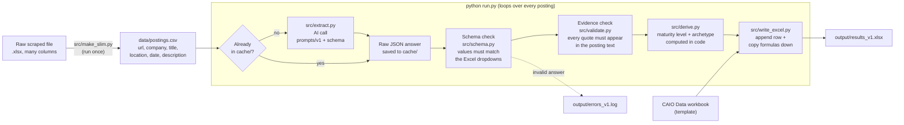

# caio-coder

Automated coding of Chief AI Officer (CAIO) job postings for the *CAIO as AI Capability Orchestrator* research project.
It reads each posting with an AI model, scores it against the research codebook (orchestration dimensions, decision-rights language, cybersecurity aspect, stakeholder span), and writes one row per posting into the CAIO Data Excel workbook.

## How it works

**Design decisions**

| Decision | Why |
|---|---|
| The AI only *codes inputs* (scores, Yes/No flags, categories). | Excel's own formulas compute the breadth score, decision-rights strength, span count and suggested maturity, so the sheet stays the single source of truth. |
| Answers are forced into a schema whose allowed values are copied from the workbook dropdowns. | The model cannot return a category Excel would reject. |
| Every non-zero score needs a verbatim quote, and the quote is checked against the posting. | Cheap guard against invented evidence; failures are flagged in *General Notes / Flags*. |
| Maturity level and archetype are calculated in code. | Reproducible and consistent with the sheet's formulas; the archetype rule is a v1 draft in `src/derive.py`. |
| Raw model answers are cached per prompt version; finished URLs are skipped. | Safe to stop and rerun, and re-running after a code change costs no new AI calls. |
| Prompts are versioned files (`prompts/v1`, `v2`, ...). | Each run records which instructions produced which results. |

## Status

- [x] Repo, schema, workbook column map
- [x] Prompt v1 (from the research plan rubric)
- [x] Slim postings file builder
- [x] Validation, derived fields, Excel writer, resumable runner
- [x] End-to-end test with fake AI answers
- [x] Real AI call in `src/extract.py` (waiting on API key and provider)
- [x] Full-dataset run
- [ ] Iterate on the prompt (v2, v3, ...) using real results
